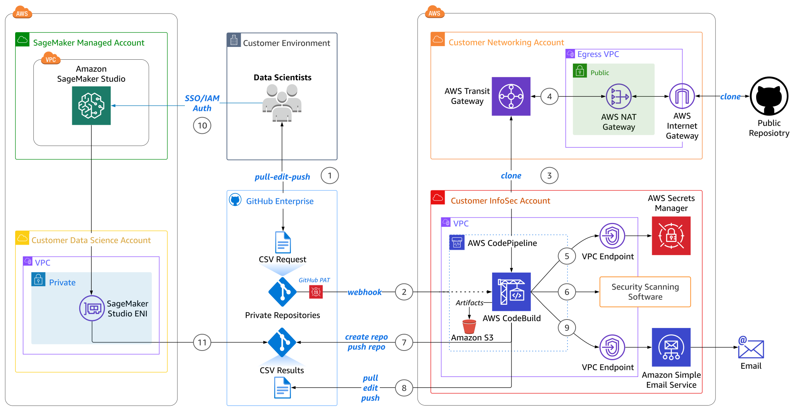
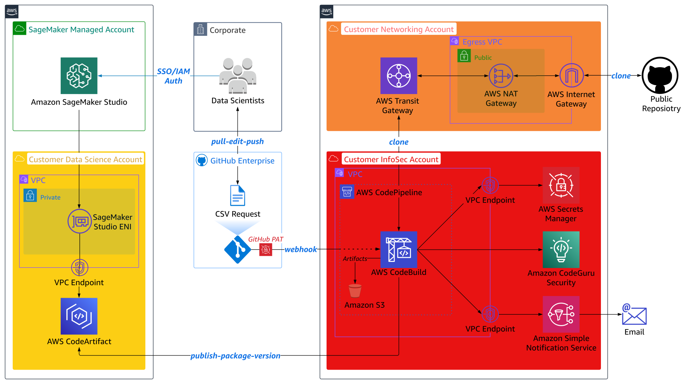

# External Package Repository Security: Amazon SageMaker, Amazon CodeGuru Security, AWS CodeArtifact, and AWS Code Services
---
The goal of this solution is to demonstrate the deployment of AWS Code Services (e.g., [AWS CodeArtifact](https://docs.aws.amazon.com/codeartifact/latest/ug/welcome.html), [AWS CodeBuild](https://docs.aws.amazon.com/codebuild/latest/userguide/welcome.html), [AWS CodePipeline](https://docs.aws.amazon.com/codepipeline/latest/userguide/welcome.html)) to orchestrate secure MLOps access to external package repositories in an [Amazon SageMaker](https://docs.aws.amazon.com/sagemaker/latest/dg/whatis.html) data science environment configured with multi-layer security.

This solution covers three main topics:
1. Self-service data scientist workflow for using external package repositories.
2. Automated orchestration of external package repository security scanning.
3. Creating and maintaining Information Security (InfoSec) compliant private internal package repository.

## Content
- [Solution Architecture](#solution-architecture)
- [Multi-Account Configuration](#multi-account-configuration)
- [Deployment Guide](#deployment)
- [Testing and Validation](#testing-and-validation)
- [Clean Up](#clean-up)

## Solution Architecture

### Overview

<p align="center">
  
  <em>Diagram 1: External Package Repository Security Scanning Using AWS CodePipeline, AWS CodeBuild, and AWS CodeArtifact</em>
</p>

**1 – Data Scientist Self-Service Model**  
The data scientist pulls the current version of the public package repository request CSV file from the private GitHub repository, appends desired additional public package repositories to the request record, then pushes the updated request file back to the private repository.

**2, 3 – External Package Repository Ingest**  
The CodePipeline _GitHub_Internal_Repository_Pull_ build stage executes based on the request file check-in to the private GitHub repository, which triggers AWS CodePipeline execution via a webhook secured by a personal access token stored in [AWS Secrets Manager](https://docs.aws.amazon.com/secretsmanager/latest/userguide/intro.html). The subsequent _Clone_External_Repository_ build stage consists of an AWS CodeBuild project that parses the request file, identifies the public package repository to ingest, then executes _git clone_ on the remote repository. The remote public package repository is stored as a build stage output artifact in [Amazon Simple Storage Service (S3)](https://docs.aws.amazon.com/AmazonS3/latest/userguide/Welcome.html) and later used as the security test stage input artifact.

**4 – Infrastructure Security**  
Centralized Internet egress occurs through a [NAT Gateway (NGW)](https://docs.aws.amazon.com/vpc/latest/userguide/vpc-nat-gateway.html) attached to the egress [Virtual Private Cloud (VPC)](https://docs.aws.amazon.com/toolkit-for-visual-studio/latest/user-guide/vpc-tkv.html) in the Customer Networking Account, reducing the cost associated with a distributed model where NGWs are deployed in every spoke VPC. [The Elastic IP (EIP)](https://docs.aws.amazon.com/vpc/latest/userguide/vpc-nat-gateway.html) of the NGW provides customers with a single IP address that they can include in their allow-list for ingress into other external networks.

**5, 6 – Automated Security Scanning**  
CodeBuild gathers required secrets from Secrets Manager to execute security scanning software and manage GitHub artifacts in the _Security_Scans_ security test stage. CodeBuild performs agent-based static application security testing, software composition analysis, dynamic code analysis, and image vulnerability scans on the public package repository. The security test stage results are stored as an output artifact so they can be used as an input artifact in the subsequent _CodeArtifact_Internal_Repository_Push_ build stage. 

**7, 8, 9 – Security Results and Private Package Repository Management**  
If the security scans return lower than medium severities, the _CodeArtifact_Internal_Repository_Push_ build stage publishes a new _Latest_ package version to the private internal CodeArtifact package repository that was created during the initial solution deployment. CodeBuild then performs a _git pull_ of the current results CSV file, updates the file with the outcome of the latest request, then executes a _git push_ of the updated results file to the private GitHub repository. A CodePipeline notification rule then uses [Amazon Simple Email Service (SES)](https://docs.aws.amazon.com/ses/latest/dg/Welcome.html) to email the results, positive or negative, to the requesting data scientist.

**10, 11, 12 – MLOps Workflow**  
The data scientist authenticates to their [Amazon SageMaker Studio](https://docs.aws.amazon.com/sagemaker/latest/dg/studio.html) domain via [AWS Identity Center](https://docs.aws.amazon.com/singlesignon/latest/userguide/what-is.html) or [Identity and Access Management (IAM)](https://docs.aws.amazon.com/sagemaker/latest/dg/security-iam.html) mode. Each auth-mode maps to the user profile’s associated execution role that defines the user’s maximum permissible notebook actions. SageMaker Studio runs on an environment managed by AWS. Studio provides an [elastic network interface (ENI)](https://docs.aws.amazon.com/AWSEC2/latest/UserGuide/using-eni.html) that can be deployed into a customer-managed VPC for more granular control of notebook traffic. The data scientist executes their SageMaker Studio Notebook which installs the InfoSec validated external packages using the newly-created private internal repository endpoint:

```sh
aws codeartifact get-package-version-asset --domain codeartifact-domain \
--repository codeartifact-internalrepository --format generic --namespace new-namespace \
--package new-package --package-version Latest --asset main.tar.gz main.tar.gz
```

❗As shown in Diagram 2 below, this solution also supports a private internal GitHub repository as the target private package repository for customers already using GitHub. Data scientists' notebooks will follow the same pattern of installing InfoSec validated external packages using the private repository endpoint (e.g., _pip install git+https://github.com/customer-org/new-repo.git)_.

<p align="center">
  
  <em>Diagram 2: External Package Repository Security Scanning Using AWS CodePipeline, AWS CodeBuild, and GitHub</em>
</p>

## Multi-Account Configuration
The following diagram highlights a multi-account structure where functional teams are isolated by the security, access, and billing boundaries of their AWS account:

<p align="center">
  
  <em>Diagram 3: Multi-Account Configuration Overview</em>
</p>

This is a proposed multi-account structure that can be adapted for your specific requirements, organizational and governance structure, and project methodology.

The AWS Whitepaper for [Building a Secure Enterprise Machine Learning Platform](https://docs.aws.amazon.com/whitepapers/latest/build-secure-enterprise-ml-platform/aws-accounts.html) recommends production data science environments use multiple AWS accounts for the following benefits:
- Group workloads based on business purpose and ownership
- Apply distinct security controls by environment
- Limit scope of impact from adverse events
- Improve cost visibility and control
- Constrain access to sensitive data

This solution can be expanded upon to follow a multi-account approach by deploying separate CloudFormation stacks into each respective account:
- **Customer Data Science Account:** Contains separate Amazon SageMaker Studio domains per data science team. This account is used by data scientists and ML engineers to perform experimentation and development.
- **Customer Networking Account:** Isolates the networking services, configuration, and operation from the individual application workloads, security, and other infrastructure. 
- **Customer InfoSec Account:** Dedicated to operating security services, monitoring AWS accounts, and automating security alerting and response.

The above multi-account structure can be further sub-divided. Each of these account groups can have multiple AWS accounts per environment for development and testing of services and storing different data classifications: 

❗ For production environments, we recommend the use of two additional account groups:
- **Shared Services Account:** Host common resources like team code repositories, CI/CD pipelines for MLOps workflows, Docker image repositories, [AWS Service Catalog](https://docs.aws.amazon.com/servicecatalog/latest/adminguide/introduction.html) product portfolios, and model registries. 
- **Data Management Account:** Store and manage all data for the machine learning process with strong data security and governance practices using [AWS Data Lake](https://aws.amazon.com/solutions/implementations/data-lake-solution/) and [AWS Lake Formation](https://aws.amazon.com/lake-formation/).

## Deployment Guide
see [Deployment Guide](documentation/deployment-guide.md)

## Testing and Validation
see [Testing and Validation](documentation/testing-and-validation.md)

## Clean Up
see [Clean Up](documentation/clean-up.md)

---

Copyright Amazon.com, Inc. or its affiliates. All Rights Reserved.
SPDX-License-Identifier: MIT-0
