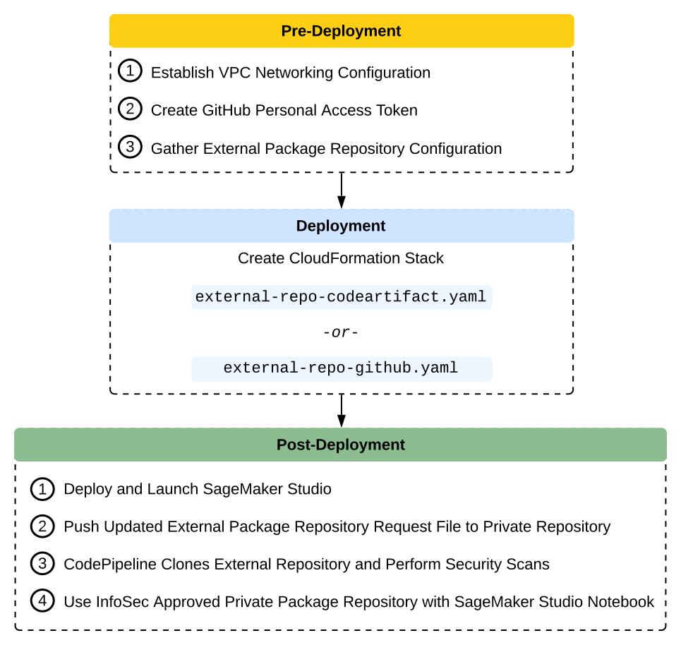
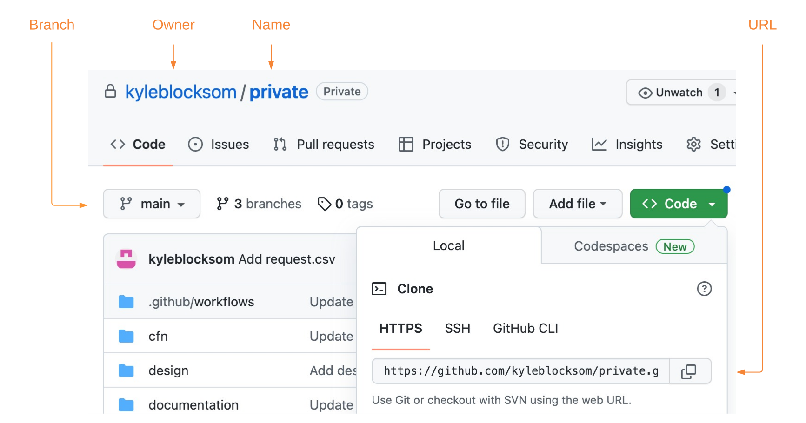

# Deployment Guide
---
## Deployment Workflow
The below workflow diagram visualizes the end-to-end deployment process that is detailed within this guide. The resultant architecture includes an AWS CodePipeline workflow orchestration that triggers based on a token-authenticated webhook with the private GitHub repository containing the public package repository request file. The workflow consists of an AWS CodeBuild project to clone remote external package repositories so that an additional CodeBuild project can be used to execute Amazon CodeGuru Security security and quality scans, then publish InfoSec-approved packages to a private internal AWS CodeArtifact (or GitHub) package repository before notifying the requesting data scientist.

<p align="center">
  
</p>

## Pre-Deployment
By default, AWS CloudFormation uses a temporary session that it generates from your user credentials for stack operations. If you specify a service role, CloudFormation will instead use that role's credentials.

To deploy this solution, your IAM user/role or service role must have permissions to deploy the resources specified in the CloudFormation template. For more details on AWS Identity and Access Management (IAM) with CloudFormation, please refer to the [AWS CloudFormation User Guide](https://docs.aws.amazon.com/AWSCloudFormation/latest/UserGuide/using-iam-template.html).

You must also have [AWS CLI](https://aws.amazon.com/cli/) installed. For instructions on installing AWS CLI, please see [Installing, updating, and uninstalling the AWS CLI](https://docs.aws.amazon.com/cli/latest/userguide/cli-chap-install.html).

### Fork and Clone [_External Package Repository Security: Amazon SageMaker and AWS Code Services](https://github.com/aws-samples/sagemaker-external-repository-security/tree/main)
Follow [GitHub's instructions](https://docs.github.com/en/get-started/quickstart/fork-a-repo?tool=webui&platform=mac) to fork this repository. This creates a copy of the repository that is disconnected from the original codebase, so you can make the appropriate modifications.

Take note of your forked repository URL and use it to clone the repository:

```sh
git clone <YOUR-FORKED-REPOSITORY-URL>
```

### Establish VPC Networking Configuration
This solution requires private VPC subnets into which you can deploy CodeArtifact, CodeBuild, and CodePipeline [VPC Endpoints](https://docs.aws.amazon.com/whitepapers/latest/aws-privatelink/what-are-vpc-endpoints.html). These private subnets must be deployed into a VPC that is also configured with a NAT Gateway (NGW) in a public subnet to facilitate Internet ingress and egress through an Internet Gateway (IGW) to clone external package repositories.

If your environment does not have the required VPC, subnets, NAT Gateway, and Internet Gateway configuration, you can create those by launching the following [CloudFormation template](https://github.com/awsdocs/aws-lambda-developer-guide/blob/master/templates/vpc-privatepublic.yaml).

Your VPC ID and two private subnet IDs will be specified as CloudFormation parameters later in the [Deployment](#deployment) section.

### Create Personal Access Token (PAT)
To authenticate with your private GitHub repository, you will use a GitHub PAT. You may prefer to use a [GitHub App](https://docs.github.com/en/apps/creating-github-apps/creating-github-apps/about-apps) to access resources on behalf of an organization or for long-lived integrations. To create your PAT, please follow the GitHub instructions for [creating a personal access token (classic)](https://docs.github.com/en/authentication/keeping-your-account-and-data-secure/managing-your-personal-access-tokens#creating-a-personal-access-token-classic). Take note of your PAT before closing your browser as you will use it for AWS Secrets Manager configuration below.

The [Deployment Automation Script](deployment-automation-script) will publish your PAT to AWS Secrets Manager using AWS CLI commands and the secret name will be used as the _GitHubToken_ CloudFormation parameter.

### Gather External Package Repository Configuration Settings
The CloudFormation template used for deploying this solution requires user-defined parameters that are specific to the external public package repository.

Navigate to the external package repository and note the following:
- Branch.
- Owner.
- Name.

<p align="center">
  
</p>

(OPTIONAL) If you are using GitHub as your private internal package repository, please also note the public and private package repository URLs, which will be used as CloudFormation parameters in the [external-repo-github.yaml](../cfn/external-repo-github.yaml) stack.

❗ The external public package repository configuration details and corresponding CloudFormation parameters can be extracted as part of an automated CSV request file workflow developed separately.

#### Optional - Run Security Scan on the CloudFormation Template
If you would like to run a security scan on the CloudFormation template using [`cfn_nag`](https://github.com/stelligent/cfn_nag) (recommended), you have to install `cfn_nag`:
```sh
brew install ruby brew-gem
brew gem install cfn-nag
```

To initiate the security scan, run the following command:
```sh
git clone https://github.com/aws-samples/sagemaker-external-repository-security.git
cd ../cfn/
cfn_nag_scan --input-path ./external-repo-codeartifact.yaml
```

## Deployment 
The following section provides instructions for deploying the paramterized [external-repo-codeartifact.yaml](../cfn/external-repo-codeartifact.yaml) CloudFormation template into your AWS account. You can also deploy the solution using the [create-codeartifact-stack.sh](../shell/create-codeartifact-stack.sh) shell script. Please note: If you are using GitHub as your private internal package repository, you will use the [create-github-stack.sh](../shell/create-github-stack.sh) shell script to deploy the [external-repo-github.yaml](../cfn/external-repo-github.yaml) stack.

The stack (`external-repo-codeartifact.yaml`) provisions the following primary resources:
1. CodePipeline Pipeline to orchestrate solution workflow.
2. CodePipeline Artifact Bucket and KMS Key to securely store compressed stage input and output artifacts.
3. CodePipeline Source Stage _GitHub_Internal_Repository_Pull_ to establish GitHub Webhook and retrieve filtered source changes.
4. CodePipeline Build Stage _Clone_External_Repository_ to clone external package repository.
5. CodePipeline Build Stage _Security_Scans_ to execute third-party agent-based static application security testing, software composition analysis, dynamic code analysis, and image vulnerability scans.
6. CodePipeline Build Stage _CodeArtifact_Internal_Repository_Push_ to push InfoSec validated external package to internal private CodeArtifact repository (assuming acceptable severity findings).

CloudFormation prepopulates stack parameters with the default values provided in the template. To provide alternative input values, you can specify parameters via `ParameterKey=<ParameterKey>,ParameterValue=<Value>` pairs in the `aws cloudformation create-stack` call. 

❗You are required to specify valid CloudFormation parameters for your prerequisite AWS resources (e.g., VPC, subntes, S3 bucket) and GitHub environment settings (e.g., GitHubBranch, GitHubOwner, GitHubRepo, GitHubToken) to be used for stack deployment. Set the corresponding CloudFormation parameters to the names, values, and resource IDs of your existing resources:

```sh
# Provide your own parameter values for CloudFormation stack and CodePipeline pipeline names
export STACK_NAME=<YOUR-STACK-NAME>
export CODEPIPELINE_NAME=<YOUR-CODEPIPELINE-NAME>

# Below parameter values acquired from 'Gather Third-Party Repository Configuration Settings' and 'Create GitHub Personal Access Token' pre-deployment
export GITHUB_PAT=<YOUR-GITHUB-PAT>
export GITHUB_BRANCH=<EXTERNAL-PACKAGE-REPOSITORY-BRANCH>
export GITHUB_OWNER=<EXTERNAL-PACKAGE-REPOSITORY-OWNER>
export GITHUB_REPO=<YOUR-PRIVATE-REPOSITORY-NAME>

# Below parameter values acquired from 'Establish VPC Networking Configuration' pre-deployment
export CODEBUILD_VPC_ID=<YOUR-VPC-ID>
export CODEBUILD_SUBNET_ID1=<YOUR-PRIVATE-SUBNET-ID-1>
export CODEBUILD_SUBNET_ID2=<YOUR-PRIVATE-SUBNET-ID-2>

# (OPTIONAL) Only required with GitHub private package repository, not CodeArtifact
export GITHUB_USER=<YOUR-GITHUB-USERNAME>
export GITHUB_EMAIL=<YOUR-GITHUB-EMAIL>
export PUBLIC_GITHUB_URL=<EXTERNAL-PACKAGE-REPOSITORY-URL>
export PRIVATE_GITHUB_URL=<YOUR-PRIVATE-PACKAGE-REPOSITORY-URL>
```

```sh
source ./create-codeartifact-stack.sh

# To deploy external-repo-github.yaml stack execute the below:
# source ./create-github-stack.sh
```

#### Deployment Automation Script

The above ```source ./create-codeartifact-stack.sh``` shell command executes the following AWS CLI commands to deploy the solution stack:

```sh
# If not already forked, fork the remote repository (https://github.com/aws-samples/sagemaker-external-repository-security.git) and change working directory to shell folder
# cd sagemaker-external-repository-security/shell/
# chmod u+x create-codeartifact-stack.sh
# source ./create-codeartifact-stack.sh

export GITHUB_TOKEN_SECRET_NAME=$(aws secretsmanager create-secret --name $STACK_NAME-git-pat --secret-string $GITHUB_PAT --query Name --output text)
export ACCOUNT_ID=$(aws sts get-caller-identity --query Account --output text)
export S3_ARTIFACT_BUCKET_NAME=${STACK_NAME}-${ACCOUNT_ID}

aws s3 mb s3://${S3_ARTIFACT_BUCKET_NAME} --region us-east-1

aws cloudformation create-stack \
--stack-name ${STACK_NAME} \
--template-body file://../cfn/external-repo-codeartifact.yaml \
--parameters \
ParameterKey=ArtifactStoreBucket,ParameterValue=${S3_ARTIFACT_BUCKET_NAME} \
ParameterKey=CodePipelineName,ParameterValue=${CODEPIPELINE_NAME} \
ParameterKey=GitHubBranch,ParameterValue=${GITHUB_BRANCH} \
ParameterKey=GitHubOwner,ParameterValue=${GITHUB_OWNER} \
ParameterKey=GitHubRepo,ParameterValue=${GITHUB_REPO} \
ParameterKey=GitHubToken,ParameterValue=${GITHUB_TOKEN_SECRET_NAME} \
ParameterKey=CodeBuildLambdaVpc,ParameterValue=${CODEBUILD_VPC_ID} \
ParameterKey=CodeBuildLambdaSubnet,ParameterValue=${CODEBUILD_SUBNET_ID1}\\,${CODEBUILD_SUBNET_ID2} \
--capabilities CAPABILITY_IAM

# You can track the CloudFormation stack deployment status in [AWS CloudFormation console](https://console.aws.amazon.com/cloudformation/home?region=us-east-1#/stacks?filteringStatus=active&filteringText=&viewNested=true&hideStacks=false) or in your terminal with the following commands:
aws cloudformation describe-stacks --stack-name $STACK_NAME --query "Stacks[0].StackStatus"
aws cloudformation wait stack-create-complete --stack-name $STACK_NAME
# After a successful stack deployment, the status changes from `CREATE_IN_PROGRESS` to `CREATE_COMPLETE`.

```

## Post-Deployment
We are using a token-based webhook to connect from the private GitHub repository containing the public package repository request file to CodePipeline. The webhook token ensures that POST requests sent to the payload URL originate from your private repository. When you set a token, you will receive the X-Hub-Signature and X-Hub-Signature-256 headers in the webhook POST request.

With your webhook in place, you are now ready to deploy and launch your SageMaker Studio environment. From your SageMaker Studio environment, you will pull the current version of the public repository request CSV file from your private GitHub repository, append the desired additional public repositories to the request record, then push the updated request file back to the private repository. This will trigger CodePipeline execution so the external package repository can be scanned for InfoSec approval then made available as a private internal package. Please continue to [Testing and Validation](../documentation/testing-and-validation.md) for step-by-step guidance.

## Testing and Validation
see [Testing and Validation](../documentation/testing-and-validation.md)

---

## README
see [README](../README.md)

---

Copyright Amazon.com, Inc. or its affiliates. All Rights Reserved.
SPDX-License-Identifier: MIT-0
