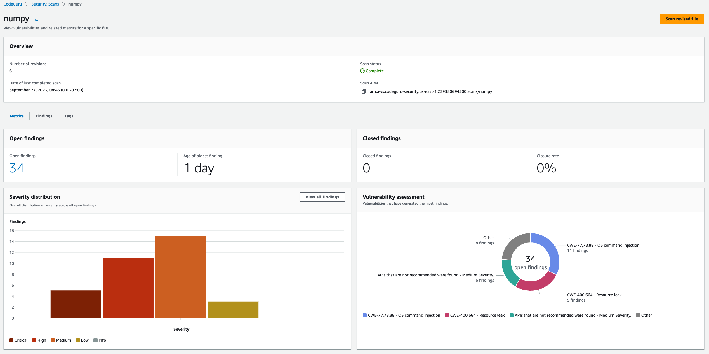
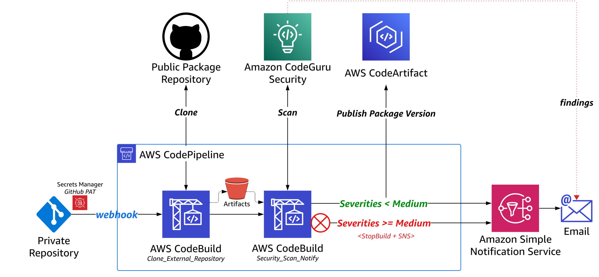
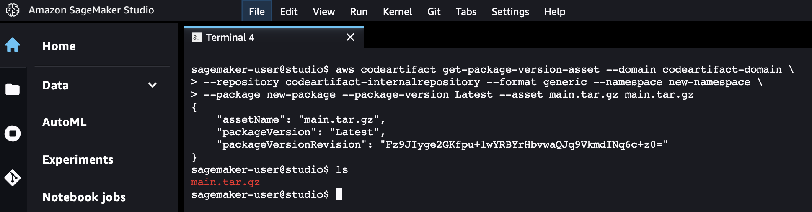
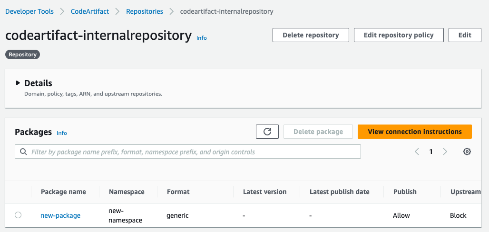

# Testing and Validation
---
## Deploy and Launch SageMaker Studio

This section provides an overview of how to use SageMaker Studio's system terminal to pull, edit, and push file copies between local and remote repositories. You can alternatively execute your git commands from your local system terminal or other notebook environment.

You can deploy Amazon SageMaker Studio into a controlled environment with multi-layer security and MLOps pipelines by following the instructions in the [Amazon SageMaker Secure MLOps Guide](https://github.com/aws-samples/amazon-sagemaker-secure-mlops).

SageMaker Studio Notebooks allow direct Internet access by default, however, this could provide an additional avenue for unauthorized access or sharing of your data. You can control your notebook data flows by launching SageMaker Studio in your Amazon Virtual Private Cloud (VPC), where traffic to and from your Studio Domain occurs through an elastic network interface (ENI) in a private VPC subnet. This solution architecture follows the [VPC-only deployment pattern](https://docs.aws.amazon.com/sagemaker/latest/dg/studio-notebooks-and-internet-access.html#studio-notebooks-and-internet-access-vpc) shown below, allowing you to restrict Internet access, monitor and inspect traffic using standard AWS networking and security capabilities (e.g., [AWS Network Firewall](https://docs.aws.amazon.com/network-firewall/latest/developerguide/what-is-aws-network-firewall.html)), and connect to other AWS resources through [VPC Endpoints powered by AWS PrivateLink](https://aws.amazon.com/privatelink/). The diagram below highlights the centralized network egress inspection architecture, where NAT Gateway (NGW) is a default route target in the private subnet route table for the Inspection VPC. Internet-bound traffic is inspected using AWS Network Firewall before it is routed to the Internet Gateway (IGW).

<p align="center">
  
</p>

<p align="center">
  <em>Diagram 4: SageMaker Studio Private Networking Architecture</em>
</p>

Once Studio is deployed, navigate to the [SageMaker console](https://console.aws.amazon.com/sagemaker/home?#/dashboard), select **Studio** from the menu on the left, select your **user profile** from the dropdown, then select **Open Studio**. This will launch your Jupyter Lab environment.

<p align="center">
  
  <em>Diagram 5: SageMaker Studio Console</em>
</p>

## Push Updated External Package Repository Request File to Private Repository

With your GitHub webhook in place, data scientists operating in SageMaker Studio can pull the current version of the public repository request CSV file from the private GitHub repository, append desired additional public repositories to the request record, then push the updated request file back to the private repository.

In the SageMaker Studio IDE, open your system terminal:

<p align="center">
  
</p>
<p align="center">
  <em>Diagram 6: SageMaker Studio JupyterLab Terminal</em>
</p>

Run the following commands in the terminal to clone your private GitHub repository then update and push your public repository request CSV file:

```sh
git init
git config --global user.email "email@example.com"
git config --global user.name "username"
git remote add origin <https://github.com/<username>/<repo>.git)>
git clone <YOUR-FORKED-REPOSITORY-URL> # ex: https://github.com/aws-samples/sagemaker-external-repository-security.git
cd <local-repo>
git checkout <branch>
vi <public-package-request.csv>
# Append your public package name and zip URL to public-repo-request-file.csv # ex: numpy,https://github.com/numpy/numpy/archive/refs/heads/main.zip
git add <public-package-request.csv>
git commit -m "Update public-package-request.csv with <PACKAGE-NAME>"
git push -u
```

❗ You will need to use a [personal access token](https://docs.github.com/en/authentication/keeping-your-account-and-data-secure/creating-a-personal-access-token) when prompted for your password following the _git push -u_ command.

## CodePipeline Clones External Repository and Performs Security Scans

CodePipeline is configured with a source action that triggers based on the data scientist's commit to the webhook-enabled GitHub source repository. CodePipeline execution then orchestrates the CodeBuild project to clone the remote package repository so that an additional CodeBuild project can be used to perform security scans on the cloned repository artifact. You can view CodePipeline's execution status from the [CodePipeline console](https://docs.aws.amazon.com/codepipeline/latest/userguide/pipelines-view-console.html#pipelines-executions-status-console):

<p align="center">
  
</p>
<p align="center">
  <em>Diagram 7: CodePipeline Execution Status</em>
</p>

CodeGuru Security performs security and quality scans on the public package repository to detect vulnerabilities and return findings. The findings include information about security issues in the public package repository code, where the vulnerabilities are, and suggestions for how to remediate them. If the finding includes a code change, CodeGuru Security highlights the vulnerable lines of code to remove and suggests inline code fixes as replacements. For more information, see [Working with findings](https://docs.aws.amazon.com/codeguru/latest/security-ug/working-with-findings.html).

The CodeGuru Security Dashboard provides metrics to track the security posture of your public package repositories, including open critical findings, severity distribution of findings and trends over time for each resource. CodeGuru Security tracks the vulnerabilities and trends across multiple revisions of the same resource using the scan name provided when a scan is created:

<p align="center">
  
  <em>Diagram 8: Amazon CodeGuru Security - Security and Quality Scan Findings</em>
</p>

The security stage output is analyzed as part of the CodePipeline orchestration. If the security scans return severity findings greater than or equal to medium, then [stop-pipeline-execution](https://awscli.amazonaws.com/v2/documentation/api/latest/reference/codepipeline/stop-pipeline-execution.html) is used to place CodePipeline into a _Stopping_ state and a [CodePipeline notification rule](https://docs.aws.amazon.com/codepipeline/latest/userguide/notification-rule-create.html) uses Amazon Simple Email Service (SES) to email the negative results to the requesting data scientist.

If the security scans return lower than medium severities, CodeBuild updates the private CodeArtifact (or GitHub) package repository with a new version of the InfoSec approved external package. CodeBuild then performs a _git pull_ of the current results CSV file, updates the file with the outcome of the latest request, then executes a _git push_ of the updated results file to the private repository. A CodeBuild notification rule then emails the positive results to the requesting data scientist.

<p align="center">
  
  <em>Diagram 9: CodePipeline Private Package Publishing Workflow</em>
</p>

You can view the packages published to the CodeArtifact private internal package repository by navigating to the [AWS CodeArtifact Console](https://us-east-1.console.aws.amazon.com/codesuite/codeartifact/start?region=us-east-1):

<p align="center">
  
  <em>Diagram 10: CodeArtifact Private Package Version</em>
</p>

## Use InfoSec Approved Private Package Repository with SageMaker Studio Notebook

Assuming the data scientist's external package repository has been approved by InfoSec, they can use their SageMaker Studio Notebook to install the validated external packages using the newly-created private repository package - Please see [Download package version assets](https://docs.aws.amazon.com/codeartifact/latest/ug/download-assets.html) from the AWS CodeArtifact User Guide:

```sh
aws codeartifact get-package-version-asset --domain codeartifact-domain \
--repository codeartifact-internalrepository --format generic --namespace new-namespace \
--package new-package --package-version Latest --asset main.tar.gz main.tar.gz
```

<p align="center">
  
</p>
<p align="center">
  <em> Diagram 11: SageMaker Studio Private Package </em>
</p>


---

## Clean Up
see [Clean Up](../documentation/clean-up.md)

---

Copyright Amazon.com, Inc. or its affiliates. All Rights Reserved.
SPDX-License-Identifier: MIT-0
